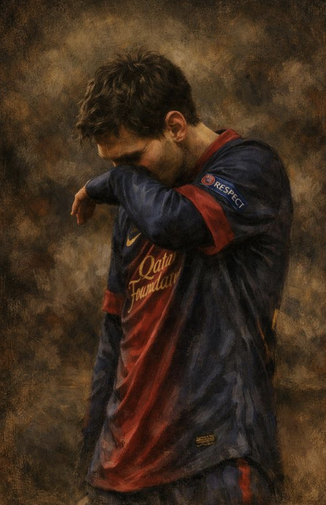

<!DOCTYPE html>
<html lang="ar" dir="rtl">
<head>
    <meta charset="UTF-8">
    <meta name="viewport" content="width=device-width, initial-scale=1.0">
    <title>قطاع العزم الأمني</title>
    
</head>
<body>

    <!-- زر القائمة المتحرك -->
    <button class="menu-btn" onclick="toggleMenu()">☰</button>

    

        <!-- شعار القطاع بنبض مستمر -->
        

            
        

        <h1>قطاع العزم الأمني</h1>
        
القطاع الأمني الرسمي والمجتمعي المتميز. انضم إلينا لبيئة احترافية، تنظيم عالٍ، وفعاليات حصرية.

        <!-- النظام التوضيحي لحالة الأقسام -->
        

            ⚠️ تنبيه: بعض الأقسام والخدمات تحت التحديث والتطوير المستمر
        

        <!-- أزرار التواصل -->
        

            <a href="https://discord.gg/azm" target="_blank" class="btn btn-discord">سيرفر الديسكورد</a>
            <a href="https://x.com" target="_blank" class="btn btn-x">حسابنا في X</a>
        

        <!-- قسم القيادة والمؤسسين -->
        

            

                
                

                    <h3>قائد القطاع</h3>
                    
قائد قطاع عزم الأمني

                

            

            

                
                

                    <h3>أحمد المعشني</h3>
                    
ملازم أول ومؤسس

                

            

        

    

    <!-- نافذة القائمة التفاعلية -->
    

        

            <button class="close-btn" onclick="toggleMenu()">✕</button>
            <h2 style="color: #00FF66; font-size: 18px; margin-bottom: 5px;">قائمة القطاع</h2>
            

                <a href="#" class="modal-link">الرئيسية</a>
                <a href="#" class="modal-link">قوانين القطاع (قريباً)</a>
                <a href="#" class="modal-link">متجر القطاع (قريباً)</a>
                <a href="#" class="modal-link">تقديم الوظائف (مفتوح)</a>
                <a href="#" class="modal-link">فريق الإدارة</a>
            

        

    

    
</body>
</html>
